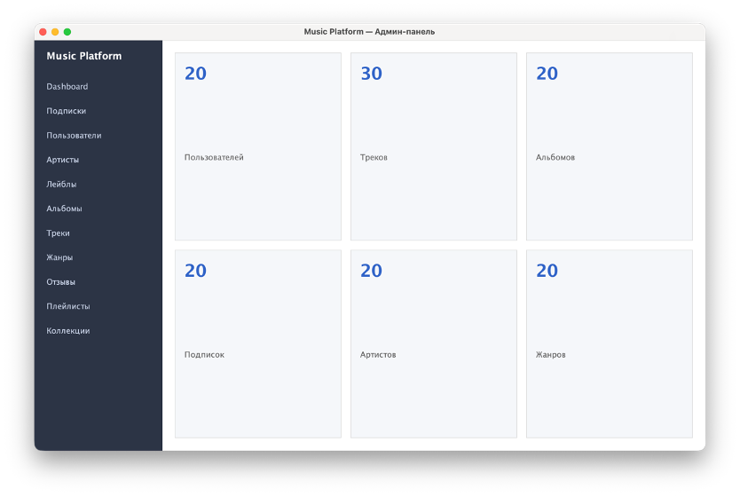
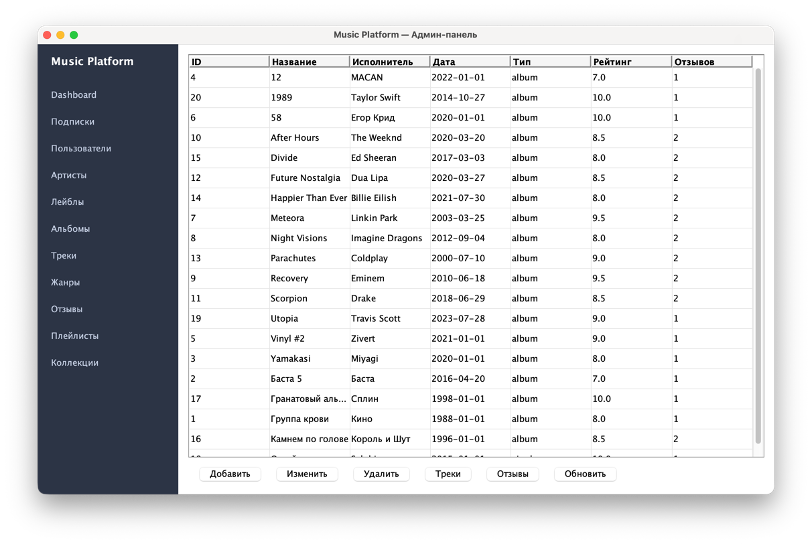

# MusicPlatform (Ru)

> Клиентское приложение для администрирования музыкальной платформы

---

## Идея

Данный проект выполнен в рамках курсовой работы по базам данных.

Приложение реализует функциональность для управления базой данных музыкальной платформы 
(поиск музыкальных композиций, добавление / удаление / редактирование записей, создание подборок).

Программа написана по двухзвенной архитектуре – СУБД Postgresql + клиентское приложение на JAVA.
Для доступа к данным из БД используется шаблон DAO (Data Access Object), а GUI (Graphical User Interface) написан с помощью библиотеки Swing.

---

## Запуск приложения

Для самостоятельной сборки необходимо создать базу данных в Postgresql (в проекте есть sql-скрипты для создания таблиц, заполнения их данными и создания объектов БД)
и заполнить параметры подключения в **config/connection.properties**

Для упрощения установки приложения был собран [установочный пакет](https://github.com/Kotop3ska/MusicPlatform/releases/download/v1.0.0/MusicPlatform_setup.zip) для ОС семейства Windows, включающий скрипт для запуска контейнера Docker с базой данных и ее инициализации, установщик клиентского приложения и инструкцию по инсталляции.

---

# MusicPlatform (RU)

> Client application for managing a music platform

---

## Idea

This project was completed as part of a coursework assignment in database systems.

The application implements functionality for managing a music platform database
(track search, adding / deleting / editing records, creating collections).

The program is built using a two-tier architecture – PostgreSQL DBMS + Java client application.
Data access is implemented using the DAO (Data Access Object) pattern, and the GUI (Graphical User Interface) is built using the Swing library.

---

## Running the Application

To build the project manually, you need to create a PostgreSQL database (the project includes SQL scripts for table creation, data population, and database object creation)
and configure the connection parameters in **config/connection.properties**

For easier installation, a prebuilt package has been created:  
[installation package](https://github.com/Kotop3ska/MusicPlatform/releases/download/v1.0.0/MusicPlatform_setup.zip) for Windows systems, 
including a script to launch a Docker container with the database and its initialization, a client application installer, and installation instructions.

---

# Скриншоты / Screenshots

  
   

